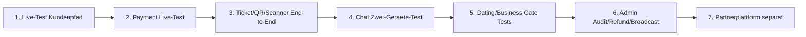

# HotMess Funktionsstruktur

Stand: 17.06.2026

Diese Datei trennt den aktuellen Stand in zwei Ebenen:

1. Funktionen, die im Code vorhanden und live erreichbar sind.
2. Funktionen, die bereits programmiert/vorbereitet sind, aber noch nicht voll produktiv funktionieren oder noch externe Einrichtung brauchen.

## 1. Aktuell live / benutzbar

```mermaid
flowchart TD
  A["HotMess App"] --> B["Public / Einstieg"]
  A --> C["Kunden-App Zone B"]
  A --> D["Admin Zone F"]
  A --> E["Scanner Zone E"]

  B --> B1["Landing Page /"]
  B --> B2["Login / Register"]
  B --> B3["Onboarding"]
  B --> B4["Verify Start"]
  B --> B5["AGB / Datenschutz / Impressum"]
  B --> B6["Instagram-Prototyp /instagram-prototype"]

  C --> C1["Bottom Navigation"]
  C1 --> C1a["Home /feed"]
  C1 --> C1b["Dating auf Watch-Tab /dating"]
  C1 --> C1c["Nachrichten /chat"]
  C1 --> C1d["Business auf Entdecken-Tab /business"]
  C1 --> C1e["Profil /profile"]

  C1a --> F1["Story-Leiste"]
  C1a --> F2["Posts anzeigen"]
  C1a --> F3["Like / Kommentare API"]
  C1a --> F4["Event-Aktivitaet inline"]
  C1a --> F5["Create Post /create"]
  C1a --> F6["Friends Activity /friends"]
  C1a --> F7["Notifications /notifications"]
  C1a --> F8["Explore People /explore/people"]

  C1c --> CH1["Inbox mit Notes"]
  C1c --> CH2["Conversation List"]
  C1c --> CH3["Swipe-Aktionen"]
  C1c --> CH4["Unread / Archiv / Mute"]
  C1c --> CH5["Neue Nachricht /chat/new"]
  C1c --> CH6["Requests /chat/requests"]
  C1c --> CH7["Thread /chat/[id]"]
  CH7 --> CH8["Nachrichten senden"]
  CH7 --> CH9["Typing Presence"]
  CH7 --> CH10["Offline Queue"]
  CH7 --> CH11["Reaktionen / Antworten / Weiterleiten / Pin / Edit / Zurueckrufen / Melden"]
  CH7 --> CH12["Gruppen-Info Panel"]

  C1e --> P1["Eigenes Profil"]
  C1e --> P2["Profil bearbeiten"]
  C1e --> P3["Settings"]
  C1e --> P4["Security Settings"]
  C1e --> P5["QR / Sessions / Search History"]
  C1e --> P6["Andere Profile /u/[username]"]

  C --> T["Events / Tickets"]
  T --> T1["Events Liste /events"]
  T --> T2["Event Detail /events/[slug]"]
  T --> T3["Checkout Wizard"]
  T --> T4["Waitlist Seite"]
  T --> T5["Meine Tickets"]
  T --> T6["QR API"]
  T --> T7["Stripe / PayPal Webhook-Routen"]
  T --> T8["Reservation Expire Cron"]

  C1b --> DA1["Dating Gate / Opt-in"]
  C1b --> DA2["Dating Profil"]
  C1b --> DA3["Swipe Stack"]
  C1b --> DA4["Matches"]
  C1b --> DA5["Likes"]
  C1b --> DA6["Filter"]
  C1b --> DA7["Premium UI"]

  C1d --> BU1["Business Gate / Opt-in"]
  C1d --> BU2["Business Profil"]
  C1d --> BU3["Suggestion Stack"]
  C1d --> BU4["Business Connect"]
  C1d --> BU5["Matches"]
  C1d --> BU6["Job Board"]
  C1d --> BU7["Job Detail"]
  C1d --> BU8["Job Bewerbung via Chat"]

  D --> AD1["Admin Dashboard"]
  D --> AD2["Events CRUD"]
  D --> AD3["Live Sales"]
  D --> AD4["Event Operations"]
  D --> AD5["Settlement UI"]
  D --> AD6["Users / Rollen / Sanktionen"]
  D --> AD7["Moderation"]
  D --> AD8["Codes / Scanner"]
  D --> AD9["Finance / Partners / Settings"]

  E --> SC1["Scanner UI"]
  E --> SC2["Scan API"]
```

### Kurzliste live

| Bereich | Live erreichbar | Status |
|---|---:|---|
| Auth/Login/Register | Ja | Supabase angebunden |
| Profil/Settings | Ja | echte Supabase-Profil-/Privacy-Daten |
| Feed/Social | Ja | Feed, Posts, Likes, Stories-Grundlage |
| Chat/Inbox | Ja | inkl. Notes, Requests, Swipe, Typing Presence, Offline Queue |
| Events/Tickets | Ja | Eventseiten, Checkout-Flow, Tickets/QR-Grundlage |
| Dating | Ja | Tabellen/Migrationen eingespielt, Profile/Swipe/Matches sichtbar |
| Business & Jobs | Ja | Profile, Vorschlaege, Connect, Jobs, Bewerben |
| Admin | Ja | zentrale Admin-Routen sichtbar, sensible Aktionen serverseitig |
| Scanner | Ja | Scanner-UI und Scan-API vorhanden |

## 2. Programmiert / vorbereitet, aber noch nicht voll produktiv

```mermaid
flowchart TD
  X["Vorhanden im Code, aber noch nicht voll produktiv"] --> P["Payments & Ticketing"]
  X --> S["Social / Stories"]
  X --> C["Chat Maximalfunktionen"]
  X --> D["Dating"]
  X --> B["Business"]
  X --> A["Admin"]
  X --> V["Vertriebspartner"]
  X --> I["Infrastruktur / App"]

  P --> P1["Echte Stripe/PayPal Live-Zahlung final testen"]
  P --> P2["Webhook-Secrets/Live-Keys final"]
  P --> P3["Wartelisten-Cron + automatische Promotion"]
  P --> P4["Add-ons vollstaendig abrechnen und Settlement-verknuepfen"]
  P --> P5["Event-Storno mit Refund produktiv"]
  P --> P6["500-parallel Load-Test"]
  P --> P7["Scanner Offline-Fallback final"]

  S --> S1["Watch/Reels Feed ist Platzhalter"]
  S --> S2["Story Polls/Fragen/Antworten voll verdrahten"]
  S --> S3["Story Highlights + Auto-Stories final"]
  S --> S4["Story Expire Cron produktiv pruefen"]
  S --> S5["Teilen/Speichern/Kommentare UI voll ausbauen"]

  C --> C1["Calls API vorbereitet, aber WebRTC/TURN/SFU fehlt"]
  C --> C2["Voice Transkript/Translate nur vorbereitet"]
  C --> C3["Native Swipe-UX ist eingebaut, muss live mobil getestet werden"]
  C --> C4["Typing Presence muss mit 2 Accounts live getestet werden"]
  C --> C5["Offline Queue muss mit echtem Offline-Test getestet werden"]

  D --> D1["Dating Abo-Zahlung Plus/Gold/Platinum"]
  D --> D2["Consumables: Boosts/Superlikes kaufen"]
  D --> D3["Top Picks Cron"]
  D --> D4["Event Dating Pool Sync Cron"]
  D --> D5["Zimmerbuchung beidseitig"]
  D --> D6["Meetup Prompt nach Event"]
  D --> D7["Rewind/Boost/Priority voll serverseitig gaten"]

  B --> B1["Coffee Chat echte Zeitwahl + Kalender"]
  B --> B2["Business Plus Zahlung"]
  B --> B3["Job inserieren mit Plus/Einzelzahlung"]
  B --> B4["Gruppen erstellen + Plus Gate"]
  B --> B5["Wer hat mein Profil gesehen"]
  B --> B6["Business Analytics"]

  A --> A1["Broadcast Versand/Tracking produktiv"]
  A --> A2["Finance Export CSV/Excel"]
  A --> A3["Partner-Abrechnung voll"]
  A --> A4["Analytics komplett dynamisch"]
  A --> A5["2FA-Pflicht fuer Admins final erzwingen"]
  A --> A6["Admin Audit fuer jede sensible Aktion vollstaendig pruefen"]

  V --> V1["Separate App partner.hotmess.app noch nicht voll gebaut"]
  V --> V2["Partner Auth"]
  V --> V3["Referral Tracking Bridge"]
  V --> V4["Provisionen / Overrides / Payouts"]
  V --> V5["Material-Bibliothek"]
  V --> V6["Anwalts-/Steuerberater-Freigabe"]

  I --> I1["PWA Installierbarkeit final Lighthouse testen"]
  I --> I2["Push OneSignal final mit echten Keys"]
  I --> I3["E-Mail Resend final mit echten Keys"]
  I --> I4["Domain/Webhooks Live-Check wiederholen"]
```

### Kurzliste noch nicht voll produktiv

| Bereich | Was existiert | Was fehlt noch |
|---|---|---|
| Stripe/PayPal | API-Routen, Checkout-Auswahl, Webhooks | Live-Keys, echter End-to-End-Test, Refunds |
| Waitlist | Waitlist-Seite/Grundlage | Cron-Promotion und Benachrichtigung |
| Add-ons | UI im Checkout | vollstaendige Buchung/Settlement/Operations-Verknuepfung pruefen |
| Watch/Reels | Route vorhanden | echter Video-Feed |
| Stories | Viewer/Grundlage | Polls, Fragen, Highlights, Auto-Stories final |
| Chat Calls | API vorbereitet | WebRTC, TURN, SFU, Live-Anruf-Infrastruktur |
| Dating Premium | UI vorhanden | Zahlungen, Verbrauchszaehler, Cron-Jobs, Room Consent |
| Business Plus | UI vorhanden | Zahlung, Plus-Gates, Gruppen/Jobs/Coffee-Chats final |
| Admin Broadcast | UI vorhanden | echter Versand + Tracking |
| Partnerprogramm | Konzept/Route vorhanden | separate App, Auth, Tracking, Provisionen |
| PWA/Push | vorbereitet | Lighthouse/Device-Test und echte OneSignal-Keys |

## 3. Naechste sinnvolle Reihenfolge

Empfohlene Tests als naechstes:

1. Kundenkonto: Login, Profil, Feed, Chat, Tickets.
2. Zwei Accounts: Chat senden, Typing sichtbar, Offline-Nachricht senden.
3. Event: Ticket kaufen im Testmodus, QR anzeigen, Scanner pruefen.
4. Admin: Event bearbeiten, User-Rolle/Sanktion, Moderation.
5. Dating/Business: Opt-in, Profil anlegen, Match/Connect pruefen.
